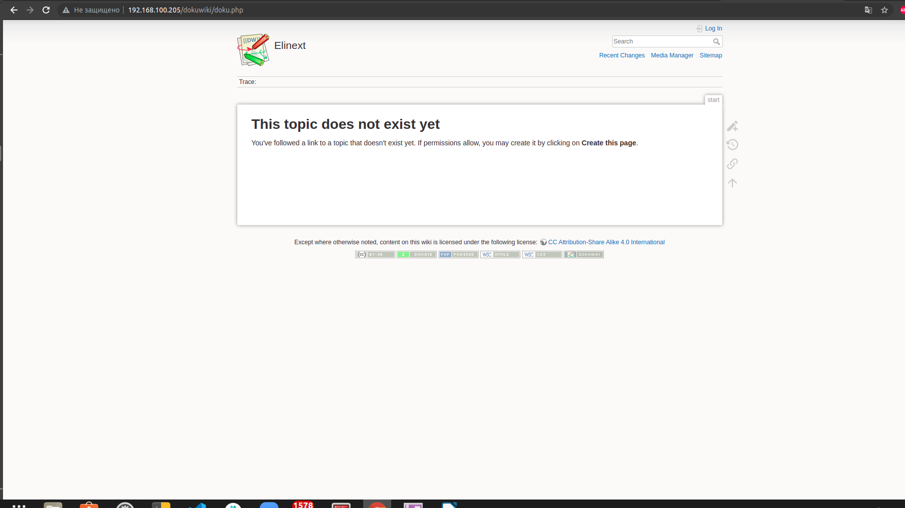
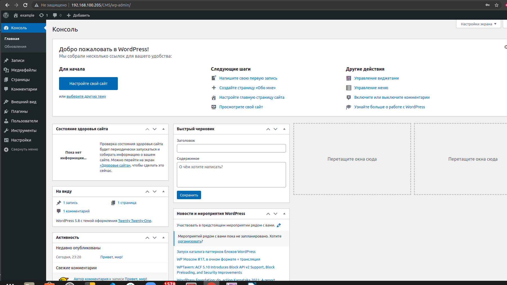
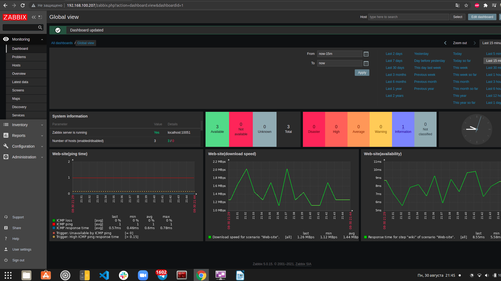
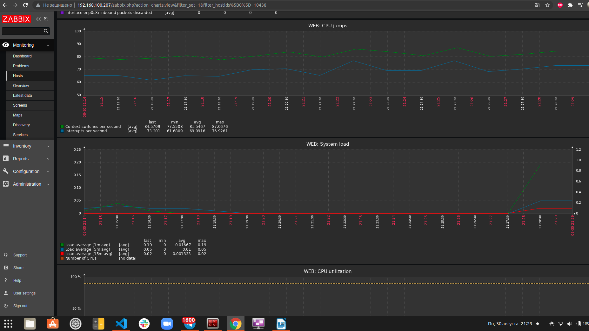
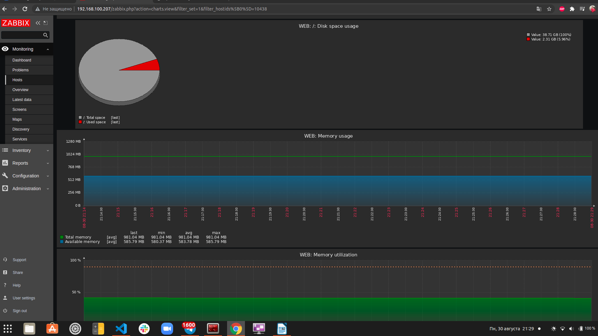

# Test task

## Test's reporter: Alex, Kolyago
------

## Task 1.

### 1.1 Installing PHP 7.4 with Apache

```bash
sudo apt install php libapache2-mod-php
```
Downloading Dokuwiki and unpacking
Then changing owner and configuring apache config

```bash
59  cd /var/www/
60  sudo wget https://download.dokuwiki.org/src/dokuwiki/dokuwiki-stable.tgz
61  sudo tar -xvf dokuwiki-stable.tgz
62  sudo mv dokuwiki-*/ dokuwiki
63  cd dokuwiki/
64  ll
65  sudo chown -R www-data:www-data /var/www/dokuwiki
66  cd ..
67  ll
69  sudo a2enmod rewrite
71  sudo systemctl restart apache2
73  sudo vim  /etc/apache2/sites-enabled/000-default.conf 
```
    DocumentRoot /var/www/

After that changing "AllowOverride" and restarting Apache

```bash
<Directory /var/www/>
        Options Indexes FollowSymLinks
        AllowOverride All

75  sudo vim /etc/apache2/apache2.conf
76  sudo systemctl restart apache2
```

### 1.2 LAMP on 2 VMs

```bash
sudo apt-get install php-fpm php-mysql mysql-client-core-8.0
```

### VM2(mysqlBD)

Installing mysqlDB and configuring

```bash
sudo apt-get install mysql-server

sudo vim /etc/mysql/mysql.conf.d/mysqld.cnf
    bind-address            = 192.168.100.205
```

Creating DB and user for remote host

~~~~sql
CREATE DATABASE wordpress;
CREATE USER 'vagrant'@'192.168.100.205' IDENTIFIED BY '****';
GRANT ALL PRIVILEGES ON wordpress.* TO 'vagrant'@'192.168.100.205';
FLUSH PRIVILEGES;
~~~~



### Installing wordpress CMS on VM1 and coniguring it.

```bash
curl -O https://wordpress.org/latest.tar.gz
tar xzvf latest.tar.gz

cp ~/wordpress/wp-config-sample.php ~/wordpress/wp-config.php
```
Some changes on the photo.

```bash
sudo cp -a ~/wordpress/* /var/www/html
sudo chown -R www-data:www-data /var/www/html
```



### 1.3 Attach virtual hosts to Zabbix monitoring system using agent. 

Installing Zabbix server on VM3

```bash
wget https://repo.zabbix.com/zabbix/5.0/ubuntu/pool/main/z/zabbix-release/zabbix-release_5.0-1+focal_all.deb
sudo dpkg -i zabbix-release_5.0-1+focal_all.deb
sudo apt update

sudo apt install mariadb-server zabbix-server-mysql zabbix-frontend-php zabbix-nginx-conf zabbix-agent
```

Configuring MariaDB for Zabbix

~~~~sql
create database zabbix character set utf8 collate utf8_bin;
create user zabbix@localhost identified by '****';
grant all privileges on zabbix.* to zabbix@localhost;
~~~~

Import initial schema and data

```bash
zcat /usr/share/doc/zabbix-server-mysql*/create.sql.gz | mysql -uzabbix -p zabbix
```

Configure the database, nginx for Zabbix server

```bash
sudo vim /etc/zabbix/zabbix_server.conf
sudo vim /etc/zabbix/nginx.conf
sudo vim /etc/zabbix/php-fpm.conf

vagrant@ubuntu-elinext-zabbix:~$ sudo nginx -t
nginx: the configuration file /etc/nginx/nginx.conf syntax is ok
nginx: configuration file /etc/nginx/nginx.conf test is successful

vagrant@ubuntu-elinext-zabbix:~$ sudo systemctl status zabbix-server
● zabbix-server.service - Zabbix Server
     Loaded: loaded (/lib/systemd/system/zabbix-server.service; enabled; vendor preset: enabled)
     Active: active (running) since Mon 2021-08-30 15:52:53 UTC; 1min 30s ago
   Main PID: 1769 (zabbix_server)
      Tasks: 38 (limit: 1136)
     Memory: 27.1M
```

Installing and configuring zabbix agents on VM1-2

```bash
wget https://repo.zabbix.com/zabbix/5.0/ubuntu/pool/main/z/zabbix-release/zabbix-release_5.0-1+focal_all.deb
sudo dpkg -i zabbix-release_5.0-1+focal_all.deb
sudo apt update

sudo apt install zabbix-agent

sudo vim /etc/zabbix/zabbix_agentd.conf

sudo systemctl restart zabbix-agent
sudo systemctl enable zabbix-agent

vagrant@ubuntu-elinext:~$ sudo systemctl status zabbix-agent
● zabbix-agent.service - Zabbix Agent
     Loaded: loaded (/lib/systemd/system/zabbix-agent.service; enabled; vendor preset: enabled)
     Active: active (running) since Mon 2021-08-30 16:12:10 UTC; 49s ago
   Main PID: 7099 (zabbix_agentd)
      Tasks: 6 (limit: 1136)
     Memory: 4.9M

sudo ufw allow 10050/tcp
```

#### Adjusting web monitoring sites:



#### For each host configure monitoring of resources usage:





------

